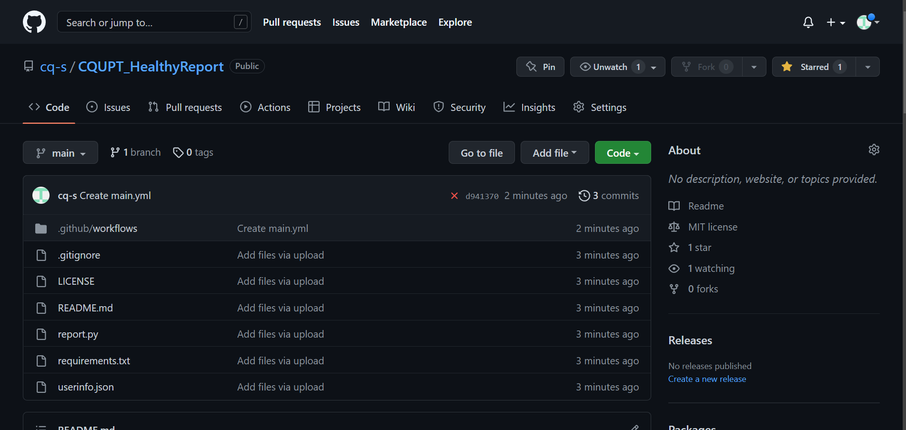
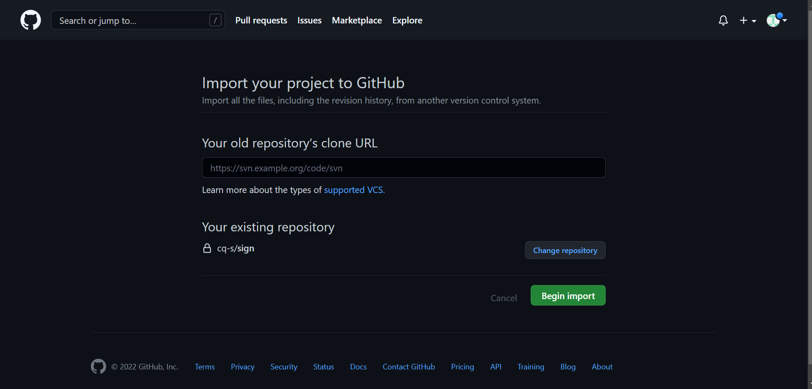
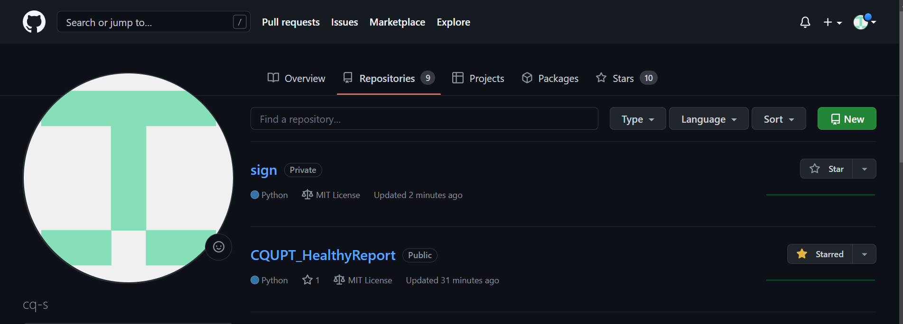
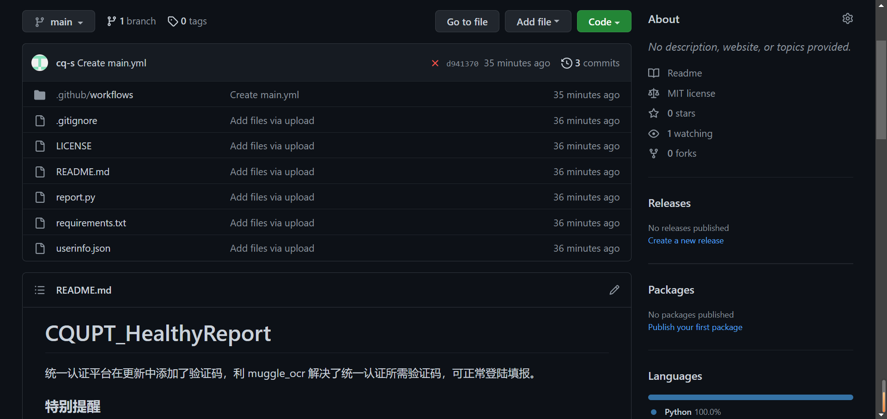
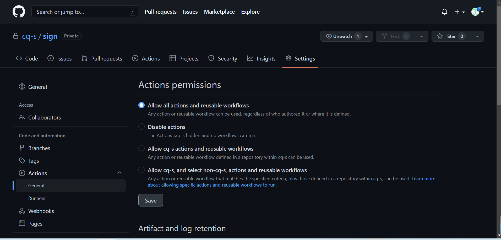

#Campusphere_Sign

统一认证平台在更新中添加了验证码，利用 muggle_ocr 解决了统一认证所需验证码，可正常登陆填报(目前平台已不再需要验证码，当使用Github Actions 云端运行且需要验证码时请复制`main-ocr.yml`中的内容：替换 .`github/workflows-main.yml`中的所有内容)。

### 仓库介绍

这里仅技术论证了今日校园辅导猫的自动填写，一定程度上可以节约**无异常情况同学**完成签到的时间，但**请不要用该程序做出违反相关规定的事情！**

**如果有特殊情况，请立即停用并修改当天记录为实际情况！**

**因隐瞒实际状况导致的一切后果，本项目一概不负责！**
 
### **云端部署警告**

如果你需要将项目部署至 Github Actions 云端运行，请务必将仓库属性设置为**私有**!否则你的统一认证账号可能泄露。

由于相关库过多造成依赖文件大于云函数所允许的最大值目前可能无法使用(需要验证码时)。

当不需要验证码进行验证登录时将`report.py`中的内容替换到云函数的`index.py`,同时填写`userinfo.json`上传并安装`requirements.txt`中的依赖即可

默认执行时间设置在北京时间6:32和22:32（GitHub使用UTC时间，应为22:32和14:30），则设置corn触发的表达式为: `32 14 * * *`  如需修改可前往：.github/workflows-main.yml-schedule修改corn表达式

特别注意：(由于 Github Actions 的校时有误差,在设定时间的前后半小时均为正常现象，请自行实验合适的时间)。

### 使用方式
#### 方式一
> (使用Github Actions)
---
1.登录自己的GitHub账号后点击右上角的`Star`

---


---
2.创建新仓库[点击创建自己的仓库](https://github.com/new/import)

---
3.在`Your old repository’s clone URL`处填入
```
https://github.com/cq-s/CQUPT_HealthyReport
```
---
4.然后在`Repository name`处填写仓库名,随便填，例如`sign`，选择`Private`

---
5.最后点击最下方的`Begin import`，等待导入完成。

---


---
6.再次点击右上角的头像选择 `Your repositories`
找到刚才导入的项目，填写`userinfo.json`文件即可(填写说明见方法二第三步),如需修改时间请按`云端部署警告`中的说明进行修改。

---


---


---
7.在`settings`中选择`Actions`>  `General`>`Allow all actions and reusable workflows`，最后点击`save`保存即可。

---

#### 方式二(本地或服务器运行,配合定时计划使用)
> 建议 Python 版本 >= 3.6
---
1.下载文件(或者直接下载)
```
git clone https://github.com/cq-s/campusphere.git
```
---
2.安装依赖
```
pip3 install -r requirements.txt
```
 (当需要验证识别时请使用)
 ```
 pip3 install -r requirements-ocr.txt
 ```
---
3.填写`userinfo.json`文件
```json
[
#第一个用户的信息
{"username":"",---登录教务系统的账号
"password":"",---登录教务系统的密码
"school":"长江师范学院",---学校全名
"id":"x-x-x-x-x",---设备id，即自己手机对应的设备号用于模拟你的手机提交从而避免系统因为检测到设备更换而弹出验证码
"email":"" },---自己的邮箱地址，用于接收打卡完成通知，不需要可留空
#第二个用户的信息
{"username":"",
"password":"",
"school":"长江师范学院",
"id":"x-x-x-x-x",
"email":""}
]

注：需要几个用户就添加几个字典，最后一个用户信息后没有`,`
获取设备id的方法：1.打开手机文件管理搜索 wismcp
                2.如果有搜索到直接进入步骤4
                3.若未搜索到，找到任何一个历史任务，点击查看信息弹出图片验证码界面后再次在文件管理搜索即可
                4.打开wismcp文件夹下的device文件夹然后看到device_id.json这个文件后用电脑记事本打开它并将里面的内容复制填写到id对应的地方即可
```

4.直接运行

```
python3 report.py
```
(当需要验证识别时请使用)
 ```
  python report-ocr.py
 ```
---


